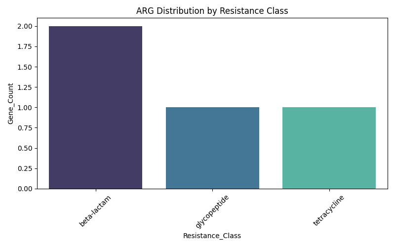

# Clinical Metagenomic ARG Profiling (Example Project)

This project demonstrates a simple antibiotic resistance gene (ARG) summary pipeline for clinical metagenomics using Python.  
It simulates annotation parsing, summarizes ARGs by resistance class, and generates a publication-style barplot.

---

## 🔬 Project Overview

- Input: Simulated ARG annotations from metagenomic data
- Output: Summary table (`.csv`) and barplot image (`.png`)
- Tools: Python, pandas, seaborn, matplotlib

---

## 📁 Folder Structure

- input/: Simulated ARG annotation file
- output/: Resulting .csv and .png files
- src/: Python script for ARG summary

### ARG Resistance Class Summary

